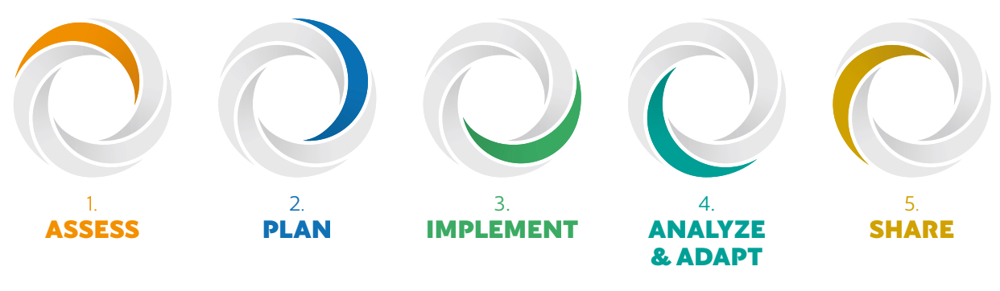
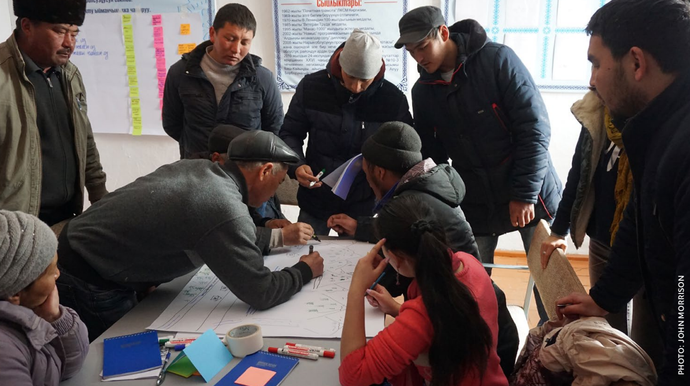

# INTRODUCTION 

## About
The Open Standards for the Practice of Conservation Version 5.0 is the product of inputs, field tests, and discussions among members of the Conservation Measures Partnership (CMP), the Conservation Coaches Network (CCNet), and the Conservation Standards community more generally. CMP has final editorial authority over the Conservation Standards.

**What Is the Conservation Measures Partnership (CMP)?**
[The Conservation Measures Partnership (CMP)](https://www.conservationmeasures.org/about-cmp/) is a global community of NGOs, government agencies, funders, and private businesses working together to design, manage, and measure conservation action. Guided by the Conservation Standards, CMP members collaborate to share knowledge, adopt best practices, and avoid ineffective approaches—ultimately enhancing conservation efficiency and innovation worldwide.

:::{seealso} Current CMP members (2025)
:class: dropdown
African Wildlife Foundation; Alcedo Conservation; Bush Heritage Australia; Chester Zoo; Conservation X Labs; Conservation Management; Disney’s Animals, Science, and Environment; Durrell Wildlife Conservation Trust; Endangered Wildlife Trust; Environmental Incentives; Foundations of Success; The Gordon and Betty Moore Foundation; International Crane Foundation; Jane Goodall Institute; Keith Campbell Foundation for the Environment; Kent Wildlife Trust; Lemu; Margaret A. Cargill Foundation; National Fish and Wildlife Foundation; The Nature Conservancy; Nature Conservancy of Canada; NOAA’s Coral Reef Conservation Program; The Pew Charitable Trusts; Puget Sound Partnership; Rare; San Diego Zoo Wildlife Alliance; The Summit Foundation; TRAFFIC; US Agency for International Development; US Fish and Wildlife Service; Walton Family Foundation; Wildlife Conservation Network; Wildlife Conservation Society; and World Wide Fund for Nature.
:::

**Revisions and Updates:** The Conservation Measures Partnership has editorial authority over the Conservation Standards. This is a living document that CMP members will continue to revise and improve over time. For updated versions, guidance materials, and further information, visit the wesbsites at [CMP](www.conservationmeasures.org) and the [Conservation Standards](http://www.conservationstandards.org). We welcome feedback from anyone who uses these standards–please e-mail us at: [CMPinfo@conservationmeasures.org](mailto:CMPinfo@40conservationmeasures.org).

:::{seealso} Conservation Standards 5.0 Revisions Committee
:class: dropdown
Version 5.0 was a highly collaborative effort. Eighty eight members of the broader Conservation Standards community (representing at least 33 institutions) actively contributed to this version, developing and refining content. CMP is very grateful to them for their time and insights. These individuals include: Adrienne Marvin, Amelia Grigson, Anita Diederichsen, Anne Ntongho, Annette Stewart, Ash Baker, Becky Raboy, Becky Stewart, Beth Allgood, Bridget Mattingley, Carol Bogezi, Caroline Stem, Catherine Payne, Charles Latrémouille, Clair Dougherty, Claire Relton, Cristina Eghenter, Danica Schaffer Smith, Daphne Yin, David Wilkie, Diane Detoeuf, Eduardo Cuevas, Elizabeth Nelson, Erica Cochrane, Felix Cybulla, Frank Weisenberger, Gayle Burgess, Giselle Block, Heather Barna, Helma Brandmeier, Iain Dickson, Jaclyn Lucas, Joaquin Riesgo, John Morrison, John Waugh, Jon Fisher, Josh Goldstein, Judy Boshoven, Karyne Bellehumeur, Katie Williamson, Kelly Swiech, Kelsey Schueler, Lauriane Besse Streit, Leander Lacy, Li Ying, Llara Kritzner, Lucy Rose, Maggie Lee, Marcia Brown, Marinao de la Maza, Marko Pecarevic, Matrida Simfukwe, Michael Looker, Moritz Spielberger, Nan Zeng, Narangerel Naranpurev, Nathan Karres, Nick Hutcheson, Nick Salafsky, Nick Tealer, Nico Boenisch, Nicole Gross Camp, Olivia Millard, Paloma Bravo Córdova, Paola Mejía, Pavitray Pillay, Philippa Dyson, Preston Whitt, Quinn Shurtliff, Rachel Martin, Sarah Cotter, Sarah Pearson, Sheila O'Connor, Sophie Hall Aspland, Stephan Funk, Sujata Ram, Tara Stephens, Terri Schultz, Theany Mout, Tessa Stienen, Tina Jansen van Vuuren, Vanessa Correa, Varsha Suresh, Vinaya Swaminathan, Wessyl Kelly, Will Beale, Xavi Escuté, Yaw Opoku Agyeman, Zeljka Rajovic.
:::

In addition, CMP is grateful to the CMP members who reviewed the final draft and provided important input to further
refine and improve the Conservation Standards.

```{image} https://mirrors.creativecommons.org/presskit/buttons/88x31/png/by.png
:alt: CClogo
:width: 150px
:align: left
```

Use of this Material: This work is licensed for use under a [Creative Commons Attribution-ShareAlike 4.0 International License](https://creativecommons.org/licenses/by-sa/4.0/). Under this license, you may take the Conservation Standards and adapt or modify them as you see fit, provided you a) reference the original Conservation Standards (but not in any way that suggests that CMP endorses this derived work), and b) issue the derived work under a similar Creative Commons license or equivalent. You can also formally contribute your modifications to CMP, which will consider incorporating them in a future official version of the Conservation Standards. This process ensures that the Standards evolve through the input of a wide variety of practitioners, are adaptable to individual organizations’ needs, and yet provide a carefully managed global standard for conservation work.

## Background
The conservation community is tackling large, complex, and urgent environmental problems where the stakes are high. We have great potential to have lasting impact, and we have made inspiring advances. However, the crises of biodiversity loss, climate change, and inequality require systemic responses that challenge us to confront the structures that perpetuate these crises.

Since the release of Version 1.0 of the Open Standards for the Practice of Conservation[^1] (hereafter, Conservation Standards or CS) in 2004, the conservation community has made great strides in clarifying and measuring effectiveness and impact. Even so, many conservation organizations and agencies still struggle to provide evidence for what is working, what needs improvement, and what should change.

Without wider and more systematic measurement of effectiveness and disciplined recording of our efforts, how will we know if we are progressing as rapidly as needed to achieve our conservation goals? How will we become more efficient? How will we learn from one another? And how will we be able to demonstrate our achievements and build the public and political will needed to meet the challenges we face?

The Conservation Standards respond to this challenge by providing a set of principles and practices that bring together common concepts, approaches, and terminology and promote accountability, transparency, and equitable conservation. All of this ensures that teams are in a better position to co develop effective and inclusive strategies and assess their impact.

[^1]: The term “Open Standards” is grounded in the Open Source / Creative Commons movement and means that these standards are developed through public collaboration, are freely available to anyone, and are not the property of anyone or any organization. See the [Creative Commons ShareAlike license](https://creativecommons.org/licenses/by-sa/4.0/) terms in the About This Document section.

:::{hint} CMP's VISION
CMP is inspired by a vision that conservation impacts around the world are amplified as teams use evidence, measure effectiveness, and openly share lessons with the conservation community. To realize this vision, our respective organizations aspire to:

- Assess the conservation situation and formulate our problems and solutions in terms of available evidence, expertise, and experience
- State our desired results in terms of conservation outcomes, not actions
- Track our progress towards achieving desired results 
- Adapt our strategies based on what we have learned
- Share our results respectfully, honestly, and transparently to facilitate learning and contribute to the evidence base

For a full description of member commitments, see [CMP’s Charter](https://www.conservationmeasures.org/about-cmp/#mission&vision).
:::

## Purpose
To help conservation teams realize this vision, the Conservation Standards provide a set of best practices for the successful implementation of conservation projects,[^2] oriented around a five-step management cycle:

 <br><br>

:::{hint} START AT THE APPROPRIATE STEP FOR YOUR WORK
Not all teams will start at Step 1 of the Conservation Standards. Each team should consider what work they have done already and where they are in their project management cycle, using existing work as inputs to the Conservation Standards process. In some cases, teams may find it makes sense to enter the process at a later step and come back to earlier ones as they learn more about their situation.
:::

The Conservation Standards are not an instruction manual to be followed exactly. Rather, they are meant to guide key management decisions in conjunction with other decision support tools, while fostering collaboration and providing a transparent basis for shared decision making and learning. Likewise, the Conservation Standards are designed to complement, not replace, related administrative processes and functions, such as contracting and human resources management.

This document intentionally focuses on standards – high-level practices and principles – not “how-to” guidance, which is available from various resources that CMP and Conservation Standards community members have developed (see later section on Support for Implementing the Conservation Standards).

We encourage feedback from anyone who uses these Conservation Standards email us at [CMPinfo@conservationmeasures.org](mailto:CMPinfo@40conservationmeasures.org).

[^2]: All conservation efforts at any scale can be explicitly or implicitly described as projects – a set of actions undertaken by a defined group of practitioners – including managers, researchers, community members, or other actors – to achieve defined goals and objectives. When thinking about scale, however, it can also be useful to organize groups of related projects into larger programs. These programs often serve as an administrative or funding unit, but they also may have their own higher-level goals, objectives, and actions – in effect, acting as a higher order project. In this document, we use the term “project” to represent both projects and programs at all scales.

## Evolution
The Conservation Standards are a product of the collaborative work of the Conservation Measures Partnership. Version 1.0 (2004) drew upon the results of the Measuring Conservation Impact Initiative, a 2002 study that reviewed experiences across seven fields, including conservation, to determine common approaches to good project design, management, and monitoring.

Findings included a series of principles for adaptive project cycle management. Around the same time, CMP also conducted a “Rosetta Stone” exercise to line up the existing planning systems used by different member organizations and identify similarities and differences in approaches and terminology. Building on these products, CMP member organizations contributed their institution-specific planning and implementation approaches to develop and refine Version 1.0 of the Conservation Standards.

:::{hint} BOX1: WHATS NEW IN VERSION 5.0?
:class: dropdown
Version 5.0 reflects the collective input and collaborative effort of CMP members and the broader Conservation Standards community. These individuals worked together to develop content for CMP-prioritized updates, drawing on their diverse on-the-ground implementation experiences. Main highlights include: 
- Changes to and clarifications of terminology to better communicate key concepts 
- Greater detail on Steps 3-5 
- Additional emphasis on the use and importance of evidence across all steps of the Conservation Standards 
- Clarification of the relationship between the Conservation Standards and other decision-support frameworks 
- Attention to the importance of scale to achieve greater impact 
- Emphasis on how behavior change and behavioral insights inform conservation actions 
- Update of climate change considerations 
- Refined explanation of considering and incorporating human wellbeing 
- Additional principles on equitable conservation 
- Recognition of spatial dimensions relevant to various steps 
- Initial linkage with tools and techniques from the Market Systems Development community
:::

Operationalizing the Conservation Standards is an ongoing, dynamic process that has included the development of closely aligned organization specific standards, production of more detailed guidance materials for each step, and training of project teams across the globe. CMP members and partners have been a driving force behind the Conservation Standards becoming the common and accepted practice within the conservation community. Likewise, the Conservation Coaches Network (CCNet) has been an instrumental mechanism to promote the Conservation Standards and build global capacity to implement them. 

Collectively, the Conservation Standards community has shared key insights and expertise to help CMP continue to improve the Conservation Standards, with updated versions released approximately every 5 years. Indeed, Version 5.0 is a product of extensive feedback and input across our community; at least 88 individuals, covering 33 separate organizations, actively helped develop the content. Moreover, many of those individuals and additional CMP organizations helped review the final content. Box 1 highlights the main updates in Version 5.0.

## Use
The Conservation Standards are designed for teams working in “real world” situations. CMP feels it is important for these teams to see how the CS are relevant to them. With this in mind, these standards include a range of -       examples and use more accessible first and second person language.

Using the Conservation Standards is part science, part art. Your team[^3] may find that you need to be adaptive to apply them effectively to your real-world situations. For example, although the Conservation Standards appear as sequential steps, teams rarely go through the process in a linear fashion from start to finish. Instead, they typically move back and forth through various stages of the cycle. Likewise, not all standards or outputs are appropriate under all conditions, so you will need to determine how to adapt or combine these standards with other frameworks and tools appropriate for your context (see [Recipes for Conservation: A Conservation Standards Toolkit](https://conservationstandards.org/library-item/cs-toolkit/) for ideas).

For each step in the Conservation Standards cycle ({numref}`1projcycle`), this document provides a brief description of the standards of practice and the expected outputs for that practice (see Annex 4 for a list of all outputs). The Conservation Standards process might appear complex or involved, but depending on where you are with your project, you may have already done many of the steps. You should not aim to produce flawless outputs as you go through each step. Instead, it is helpful to think of this as an iterative process in which you deliberately, yet rapidly, move through the steps, develop a credible draft of the outputs, and then revise your work as your project changes and matures. Likewise, when you encounter data gaps, do not be paralyzed state your assumptions, move forward with the best available information, and document key decisions and priority information needs. 

:::{figure} zimage/1projcycle.png
:name: 1projcycle
Open Standards for the Practice of Conservation project cycle.
:::

[^3]: Throughout the Conservation Standards, we use the familiar terms “you” and “your” intentionally to make the Conservation Standards feel more comfortable and approachable - it is a process for everyone involved in the project, including, but not limited to, organizational staff, local communities, and Indigenous Peoples.

## Other Frameworks & Tools
The Conservation Standards are one of several frameworks with associated tools used to support conservation decision making and **adaptive management**.[^4] 

[^4]: To understand how the CS have been adapted by some users and how they relate to other frameworks and tools, it is helpful to differentiate among categories. As you design, implement, and learn from your project, consider what is the most appropriate combination of decision support frameworks and tools for your context.

**Organizational and audience-based adaptations of the CS:** Some organizations modify the CS to represent their own policies, procedures, constituents, and ways of working (e.g., WWF’s Project and Programme Management Standards). In other cases, groups adapt the CS for specific audiences, particularly when Indigenous Peoples and Local Communities are leading or collaborating (e.g., Healthy Country Planning). These CS adaptations may include changes in terminology, refined guidance, or specific tool recommendations.

**Alternative adaptive management frameworks:** Alternative frameworks (e.g., Collective Impact Framework, Conservation Planning Specialist Group’s Principles and Steps, and Systematic Conservation Planning) share common goals with the CS but differ in focus and prioritize different methods or tools. However, these approaches and the CS can often complement each other, helping to strengthen both. For example, BirdLife's Project Toolkit has adopted the CS and integrated the Collective Impact Framework for multi-partner programs. 4 See glossary for definitions of bolded technical terms. **Complementary decision** **making tools:** To support specific CS steps, teams may use complementary decision-making tools (e.g., consequence tables or system maps) from other approaches. Teams can select and combine these tools based on the complexity of the problem and the preferences of the planning team. Indeed, the CS are intentionally designed to integrate principles and tools from other frameworks and approaches, allowing for flexibility and more informed decision making.

**Other conservation-related standards:** Other frequently used standards (e.g., IUCN’s Green List of Protected Areas or Conservation Assured Tiger Standards) focus on demonstrating best practices in conservation management but are not adaptive management frameworks themselves. They serve to assess how well initiatives meet specific criteria, leading to recognition or support. The use of these standards is similar to how the [Conservation Audit Tool](https://sites.google.com/view/cmp-conservation-audit-tool/home) is used to support the CS. For a deeper discussion, see this [living table](https://docs.google.com/spreadsheets/d/1OcVoirOf_jX8bqbGFWREqlxD1GAqkBj7Dk4cik1PlLo/edit?gid=1965789325#gid=1965789325) that shares a range of frameworks and tools, highlighting their complementary value.



:::{seealso} BOX 2: GETTING MORE INFORMATION ON KEY THEMES
:class: dropdown
CS 5.0 includes deeper treatment on a number of themes prioritized by our community, as summarized here. Where relevant, each CS step section integrates concepts related to these themes. In the interest of keeping the Conservation Standards focused primarily on high-level practices and principles, some thematic groups have developed supplemental briefs that explain more about the theme, provide high-level guidance, and share resources. 

Behavior Change: Almost all conservation involves human behavior. As such, applying behavioral and social science principles will help us be more effective and strategic in our work. 

Climate Change: Addressing climate change is a global conservation priority that practitioners must consider in the design and management of most conservation projects. Because potential climate impacts are complex and often not completely understood, monitoring will be key for testing hypotheses and determining where adjustments are needed. As with previous CS versions, climate change considerations are shared in green call-out boxes throughout this document.

Evidence: Conservation practitioners make decisions, take actions, and test assumptions based on a variety of evidence (e.g., traditional knowledge, basic data from studies, tacit knowledge, synthesized data sets, and well- supported theories). The CS emphasize the importance of bringing evidence into all steps. 

Equitable Conservation: In order to secure the future of our planet, we need everyone to have a voice and an opportunity to take action. CMP recognizes that to support the conservation community most effectively, we must promote equitable conservation.

Human Wellbeing: Conservation is an inherently human endeavor, and it is important to reflect how humans affect and are affected by conservation. This version includes additional information to better reflect CMP’s more detailed guidance, as well as lessons learned in applying these concepts in practice.

Scaling: The magnitude of the conservation issues we face means that we cannot simply work site by site. Instead, we also must take systematic action at the spatial, institutional, and temporal scales needed to address these global issues. This requires both "working at scale" and "going to scale."
:::

## Implementation Support
There are various ways project teams can get hands on support and guidance to implement the high-level practices and principles laid out in the Conservation Standards.

**Coaches**: Because using a results- and evidence-based approach to planning and implementation often reflects a major shift in the way organizations and individuals think and work, it can be very helpful for teams new to the Conservation Standards to work with a coach. Some organizations have in-house coaches trained in the Conservation Standards and key facilitation techniques. In addition, some organizations and consultants specialize in providing CS oriented coaching and facilitation and have a good understanding of the supporting resources and technologies that teams can use. Many of these individuals are part of the [Conservation Coaches Network (CCNet)](https://www.ccnetglobal.com/), a close partner of CMP that aims to foster an engaged cadre of coaches on every continent to support teams. CCNet also provides training and guidance for practitioners who want to become coaches, as well as a certification option for experienced coaches.

**Guidance and Tools**: CMP member organizations and partners have developed a variety of guides and tools that provide step-by-step guidance or deeper detail on key topics. As shown in {numref}`2relat`, these resources help support the implementation of the CS higher-level principles and practices. They include materials, such as organization specific how to guides, classification systems developed across institutions (e.g., conservation threats and actions classifications), online and in-person courses, case studies, videos, and course curricula. These resources are available via the [Conservation Standards](https://conservationstandards.org/) website (see Training, Case Studies, and Resource Library menus), with most written guidance materials vetted and rated by a cross-institutional committee representing both CMP and CCNet. In addition to these materials, and as discussed earlier, there are a variety of decision support resources outside the Conservation Standards traditional toolbox that teams may also wish to use.

:::{figure} zimage/2relat.png
:name: 2relat
Relationship between the Conservation Standards and associated resources.
:::

**Supporting Technology**
Supporting technology includes tools and systems that enhance a user's ability to implement the Conservation Standards. Some examples include decision-support systems, strategic planning software, project and task management tools, financial management software, wildlife and social system monitoring, and data storage systems. Many teams following the Conservation Standards have a set of core tools for brainstorming, research, documentation, calculation, collaboration, and sharing. When seeking new technologies, carefully consider your team’s needs and resources to select those options (including simple tools, such as spreadsheets and pen and paper) that best fit your needs.

**Miradi Software:** [Miradi Software](https://www.miradi.org) is an example of supporting technology designed specifically to walk practitioners through key steps of the Conservation Standards. The software serves as a tool and relational database to visualize and document the conservation context, priority actions, expected results, associated goals and objectives, and progress towards results.

Through standard colors and shapes, Miradi helps create a visual language to facilitate communication among those familiar with the Conservation Standards. Additionally, Miradi provides various areas to document key discussions, evidence, and decisions, an important feature to support adaptive management, **evidence** - **based conservation**, and learning more broadly. Miradi also supports the [Conservation Actions and Measures Library](https://www.miradishare.org/actions) (CAML), a library of vetted templates and examples of theories of change and expected results associated with conservation actions. The [Miradi](https://www.miradishare.org/)  website and [YouTube channel](https://www.youtube.com/channel/UC_mzRjfm9fx3AJj0FoRFtmg) offer a variety of training resources.

Some people conflate Miradi with the Conservation Standards, but it is important to note that it is the CS practices and principles that underpin effective conservation planning and implementation, and teams can use any tools they find useful for this. Although Miradi is a comprehensive tool that can support almost every CS step, it may not be appropriate in all contexts. Teams may prefer the familiarity or advantages of other tools or may be required by their organizations to use specific working and reporting platforms.

**Spatial Technology:** Spatial technology can play a critical role for teams applying the Conservation Standards. Geospatial methods encompass a wide range of tools that support mapping, analysis, and interpretation of spatial information. These technologies can support our understanding of biodiversity, species distribution, land use patterns and changes, habitat availability and connectivity, ecosystem processes, ecosystem service benefits, human wellbeing impacts, and climate change patterns. While geospatial technologies offer powerful tools for conservation, they also present challenges. High costs for specialized software, equipment, and skilled personnel can limit accessibility. Data quality and availability may vary across regions, leading to gaps in coverage that affect the accuracy of analyses. Additionally, geospatial methods (as well as Artificial Intelligence) require significant processing power and data storage.

**Artificial Intelligence:** Artificial Intelligence (AI) is rapidly advancing and reshaping numerous fields, including conservation. AI offers significant potential to reduce costs and increase efficiencies in planning and managing conservation projects, enhancing both the effectiveness and impact of these efforts. However, current AI models are typically trained on publicly available data from the internet, which are often incomplete, non representative, or of varying quality and accuracy. When relying on AI for conservation, it’s essential to critically evaluate the sources and reliability of the information with subject experts or the broader Conservation Standards community to ensure that your work is built upon trusted knowledge and best practices. Recognizing the challenges with existing AI models, CMP aims to develop models that understand the concepts and terminology of the Conservation Standards and that are built from a curated set of trusted and representative resources. This will significantly improve the usefulness and quality of AI-generated information for our community. We will use the [AI section](https://sites.google.com/a/fosonline.org/cmp-workspace/home) in the CMP Workspace to track progress of these developments and share tips and guidance on available tools.

:::{hint} FINDING HELP
:class: dropdown
The [Conservation Standards Resource Library](https://www.conservationstandards.org/resources) hosts a variety of resources, many of which have been reviewed and rated by a cross-institutional panel of Conservation Standards community members (CMP-CCNet Guidance Review Committee). New resources are regularly reviewed and added to the library.

Facilitated and self-paced training [options](https://www.conservationstandards.org) are available from Conservation Standards members. These training courses have been vetted by the Guidance Review Committee.

Many cross-cutting themes have [supplemental briefs](https://docs.google.com/document/d/1QudzzyBwQ_rB8RU4XEI-TGbd8ko01dCW0ZP3lnP0-cM/edit?tab=t.0#heading=h.w8lyn4onp2p7) to help you find more detail specific to that theme. These materials go beyond the high-level principles shared in the Conservation Standards to offer a start to guidance and specific resources.

[Recipes for Conservation: A Conservation Standards Toolkit](https://www.conservationstandards.org/library-item/cs-toolkit) provides a series of “recipes” for “lighter” CS approaches to different scenarios that teams typically encounter. The recipes link to Tipsheets that offer practical ideas and additional links to tools and templates (for lighter and more in-depth approaches).

The [CMP Workspace](https://sites.google.com/a/fosonline.org/cmp-workspace/home) is an internal collaborative workspace for Conservation Measures Partnership members. It includes documents, notes, and files associated with initiatives, retreats, and other CMP business. While it has products, most public-facing final products are available via the CS Resource Library.

The [Conservation Coaches Network](https://www.ccnetglobal.com/about-ccnet) can link you up with coaches, as well as more specific materials to support facilitating teams through various steps in the Conservation Standards.
:::

## General Principles
There are several essential principles and considerations relevant to all CS steps. Annex 3 provides important details on these, while Box 3 provides a high level summary. On the last consideration below, there are numerous debates as to the meaning of technical terms such as “goal,” “objective,” “strategy,” “activity,” “target,” and “milestone.” While there is no universal, consistent understanding, the Conservation Standards maintain that it is very important that project team members and partners have a clear and common definition of terms. With this in mind, the technical terms in this document were carefully selected, bolded when first fully described, consistently used thereafter, and defined in the glossary. As the Conservation Standards evolve, we find some terms need updating to improve communication and adoption of key principles and steps. {numref}`table1` includes some updates and clarifications on terminology in Version 5.0.

:::{important} BOX 3: SUMMARY OF KEY PRINCIPLES AND CONSIDERATIONS
:class: dropdown
When using the Conservation Standards, it is important to keep in mind the following (more detail in Annex 3):

**PRINCIPLES**
- Collaborate with partners 
- Involve interested parties to the fullest extent and as early in the process as possible 
- Implement conservation equitably 
- Appropriately use and contribute to the evidence base 
- Use adaptive management to manage uncertainty 
- Document your decisions 
- Foster a learning environment

**CONSIDERATIONS**
- These standards will change over time 
- These standards represent the ideal 
- These standards assume some priority setting has already taken place 
- Few projects will start applying the Conservation Standards at the beginning of their planning efforts 
- Each project is different and thus needs to customize their use of the Conservation Standards 
- These standards apply to projects at any spatial, institutional, and/or temporal scale 
- These standards focus on conservation as the main aim but can be adapted 
- These standards can be implemented using a variety of tools and guidance from natural, social, and behavioral sciences 
- These standards seek to clearly define and consistently use terminology
:::

:::{list-table} Major terminology shifts (old vs. new terms) in Version 5.0 with rationale for update.
:header-rows: 1
:label: table1

* - OLD
  - NEW
  - RATIONALE
* - Target
  - Focal Value
  - Earlier versions of the CS have used “target” to refer to a factor in the system on which a team has chosen to focus. Much of the world (including global conventions) uses the term “target” to mean the quantitative or qualitative measurement of an indicator to be achieved as part of a SMART goal or objective. Many in the CS community have expressed concerns about the way we use “target.” Given this situation, we feel our community should align our language with other sectors and global conventions.[^5]
* - Desired future state
  - Target
  - See target above
* - Strategy
  - Action
  - CS 4.0 defined a “strategy” as a set of activities with a common focus and an “action” as a general term used to refer to the work of conservation teams, including strategies, activities, and tasks. This is inconsistent with how the development, business, and military sectors use these terms. Thus, we have reversed their use as part of the following hierarchy of intervention: strategy, action, activity, task. 
* - Stakeholder
  - Interested party
  - The term “stakeholder” has colonial associations.  
:::

[^5]: There can be different types of focal values (e.g., biodiversity, climate, human wellbeing, cultural), and teams should use the terms that work best for their audiences.
