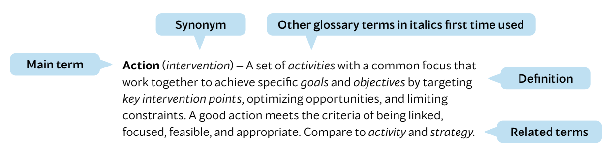
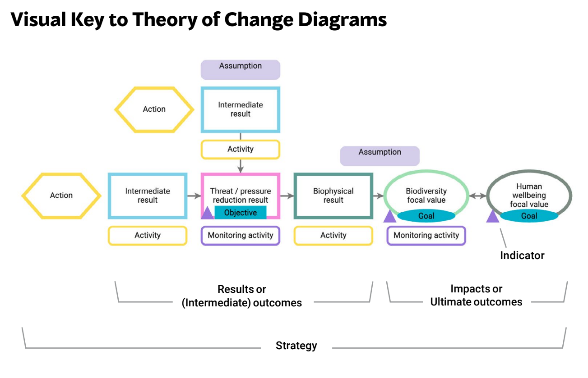

# ANNEXES

## 1. Glossary
There is an endless debate among planners as to the meaning of technical terms such as *goals, objectives, targets, milestones, impacts, outcomes, results*, and *outputs* . It seems that each organization, agency, project, and individual have their own preferred set of terms. There is no right answer – the most important thing is that the members of your project team and the people with whom you work have a clear and common understanding of whichever terms you choose to use. Nevertheless, there are advantages to having a standard glossary. To this end, technical terms in this document were carefully selected, bolded when first used, consistently used thereafter, and defined in this glossary.

### Guide to Glossary Entries
  

**Key Changes in Version 5.0**
There are a couple of notable changes in terminology in CS 5.0. These include:

- **Switching the use of the terms target and value** – As outlined in [WCPA 2024](https://conbio.onlinelibrary.wiley.com/doi/pdf/10.1111/cobi.14269) there is linguistic confusion here that people have been struggling to clean up for years. Terms are needed that describe both:

- Concept A: a factor in the system that a project team seeks to ultimately affect.
- Concept B: the quantitative or qualitative measurement of an indicator to be achieved as part of a SMART goal or objective.

CMP’s CS 4.0 and earlier use *target* to refer to Concept A and *desired future values* to refer to Concept B. In contrast, global fora, such as the CBD and WCPA, use *target* to refer to Concept B and *value* to refer to Concept A. Recognizing that we cannot shift these global conventions, we are adopting their use of these words, using *focal value* as the replacement for what CS 4.0 called a *target*.

- **Changing the use of the terms *action* and *strategy*** – CS 4.0 defines a *strategy* as a set of *activities* with a common focus and an *action* as a general term used to refer to the work of conservation teams, including strategies, activities, and tasks. This is inconsistent with how the development, business, and military sectors use these terms. As such, we have adapted our use of terms to follow the hierarchy of intervention: *strategy, action, activity, task*.

- **Replacing the term *stakeholder* with *interested* *party*** – The term *stakeholder* has colonial associations, which is why we are shifting to the more neutral term *interested party.* While these changes come at a cost in terms of both having to update our guidance and materials and in potential user confusion, we are recommending them to ensure that our use of terms is consistent with the rest of the world. We fully anticipate that there will be a transition period in which both the CS 4.0 and CS 5.0 senses of these terms will be used.

**Definitions**

**Action** ( *intervention* ) - A set of *activities* with a common focus that work together to achieve specific *goals* and *objectives* by targeting *key* *intervention points*, optimizing opportunities, and limiting constraints. A good action meets the criteria of being linked, focused, feasible, and appropriate. Compare to *activity* and *strategy* . Note: In CS 5.0, we are substituting the term “action” for the previously used term “strategy” to better fit how the rest of the world uses these terms. A *strategy* is now composed of one or more *actions* and their associated *activities*, *results* and *objectives*, and *focal values* and *goals.*

**Activity** - A set of *tasks* undertaken by project staff and/or *partners* to help implement an *action.*

**Adaptive management** The incorporation of deliberate learning into professional practice to reduce uncertainty in decision making. Specifically, it is the integration of design, management, and *monitoring* to enable practitioners to systematically and efficiently test key *assumptions*, evaluate the *results*, adjust management decisions, and generate learning. The Conservation Standards explicitly bring adaptive management principles into *conservation practice*.

**Assumption** ( *claim, hypothesis* ) - A general term used to explicitly describe what a project team believes to be true, such as the presence of a factor in a system or an assumed causal relationship between two or more *factors* in a *situation* *assessment* or a *theory of change.*

**Audit** - An assessment of a *project* or *program* in relation to an external set of criteria, such as generally accepted accounting principles, sustainable harvest principles, or the standards outlined in this document. Compare with *evaluation.*

**Behavior change** - The process of changing the actions people take or do, increasing, maintaining, or decreasing a current behavior, or adopting a new behavior.

**Biophysical factor** - A biotic or abiotic condition of a natural system that can help clarify the mechanism of how a *direct threat* affects a *focal value.* For example, inappropriate logging practices (a *threat* ) cause loss of stream shading (a biophysical factor), which raises stream water temperature (another biophysical factor), which then leads to lower salmon reproductive rates (a biophysical factor/ *stress* ) which affects a salmon population (the *focal value* ). Compare to *stress*, which is one type of biophysical factor.

**Biodiversity focal value** ( *ecological focal value* ) - A species, habitat, or ecosystem on which a project has chosen to focus. A site-based project’s chosen biodiversity focal values should collectively represent the biodiversity of concern at the site. One type of *focal* *value.*

**Conservation plan** ( *project plan, program plan* ) - The overall plan for a *project* or *program* . A complete conservation plan includes a *strategic plan,* *monitoring plan, operational plan,* and *work plan.*

**Community of practice** - A group of people who share a concern, a set of problems, or a passion about a topic, and who deepen their knowledge and expertise in this area by interacting on an ongoing basis.

**Conservation practice** - A process that involves a defined team agreeing on desired *outcomes* for a given situation and then taking action through one or more *strategies* designed to achieve these outcomes. The Conservation Standards provide a common framework and set of “better practices” that explicitly incorporate principles of collaboration, *evidence* *informed conservation*, and *adaptive management* . More broadly, a discipline that encompasses the collective people, institutions, and body of knowledge of the global conservation community.

**Conservation value** - See *focal value* . Note that this term includes not just *biodiversity focal values*, but also other types of focal values for conservation projects.

**Contributing factor** ( *indirect driver* ) - An *indirect* *threat, opportunity,* or other *factor* in a *situation* *analysis* that leads to one or more *direct threats.*

**Critical threat** - A *direct threat* prioritized as being important to address.

**Direct threat** (*pressure, direct driver*) - A human action that directly degrades one or more *focal values* (e.g., illegal logging or unsustainable fishing). It can also be a natural phenomenon altered by human activities (e.g., increase in extreme storm events due to climate change). Often tied to one or more actors. Compare with *indirect threat* . See discussion under *pressure* as to why use of direct threat can be problematic with some actors.

**Diversity** - In a social context, the variety of identities, experiences, and perspectives present in an organization, *project*, or *program* . See later section for a more detailed definition.

**Driver** - A synonym for some *factors* in a *situation* *analysis* ; direct drivers are generally equivalent to *direct threats* whereas indirect drivers are equivalent to *contributing factors*.

**Ecosystem service** - Services that intact, functioning ecosystems, habitats, and species provide that can benefit people.

**Enabling condition** - A factor that facilitates the effectiveness of a *strategy* . Typically depicted as a *contributing factor* in a *situation model* or a supporting *result* in a *theory of change* . Often an external factor that can be beyond the control of the *project team,* such as a legislative policy or consumer preference for sustainable products.

**Equitable conservation** - Conservation work that intentionally and holistically incorporates the principles of *diversity, equity, inclusion, and justice (DEIJ).*

**Equity** - Ensuring fair treatment, access, and opportunities for all individuals, while striving to identify and eliminate barriers that have historically disadvantaged certain groups. See later section for a more detailed definition.

**Evaluation** - Narrowly, an assessment of a project in relation to its own previously stated *goals* and *objectives* and/or external performance criteria. More broadly, an assessment of data to answer specific questions about a project’s context and *strategies* (see *monitoring* ). Compare with *audit*.

**Evidence** - Relevant data, information, knowledge, and wisdom used to answer questions, test *assumptions*, and inform decisions.

**Evidence** - **informed conservation practice** - The explicit and systematic generation and use of *evidence* to guide decision making in planning, implementing, and learning.

**Factor** - A generic term for an element of a *situation analysis*, including *focal values, biophysical* *factors, direct threats,* and *contributing factors.*

**Focal value** ( *value, conservation value* ) - What a project seeks to ultimately affect. Often, an element chosen to represent key aspects of the overall system. Types of *focal values* include *biodiversity values* (e.g., species, habitats, or ecosystems), climate values, cultural values, and *human wellbeing values* . Compare with *goal*, which articulates the desired future state of a focal value. Note: In CS 5.0, we are substituting the term “focal value” for the previously used term “target.” This change is to be consistent with global fora which use *value* for the focal element of a protected area and target for the desired future measurement of a SMART *goal* or *objective* (e.g., the 30 x 30 target).

**Free, prior, and informed consent (FPIC)** - This principle refers to the idea that before an action can take place that would affect a person or community positively or negatively, the person or community must give approval for the activity to move forward (“consent”). See later section for a more detailed definition.

**Goal** - A formal statement detailing a project’s desired *impact*, such as the desired future status of a *focal value.* A good goal meets the criteria of being specific, measurable, achievable, results oriented, and time limited (SMART). Compare to *vision* and *objective*.

**Human wellbeing focal value** Those components of human wellbeing on which a project has chosen to focus. In the context of a conservation project, they are often the components of human wellbeing that are linked to the status of *biodiversity focal* *values* and/or *results* from project *strategies* . Human wellbeing focal values in a project should collectively represent the array of human wellbeing needs dependent on the biodiversity focal values and/or project strategies. One type of *focal value.*

**Impact** ( *ultimate outcome* ) - The desired future state of a *focal value* . A *goal* is a formal statement of the desired impact.

**Inclusion** - The practice of creating environments where all individuals feel welcomed, valued, respected, and able to contribute fully. See later section for a more detailed definition.

**Indicator –** A measurable entity related to a specific *information need*, such as the status of a *focal value*, change in a *direct threat,* progress toward a *goal* or *objective*, or association between one or more variables. A good indicator meets the criteria of being measurable, precise, consistent, and sensitive.

**Indirect threat** ( *indirect driver, root cause* ) - A *contributing factor* identified in an analysis of the project situation that is a *driver* of one or more *direct* *threats* . Often an entry point for conservation *actions* . Compare with *direct threat* .

**Information need** ( *knowledge gap* ) - Something that people ideally should know about a project, often expressed as a question.

**Interested party** ( *stakeholder* ) - Any individual, group, or institution that has a vested interest in or can influence a project and/or that potentially will be affected by the project and has something to gain or lose if conditions change or stay the same. Interested parties are all those who need to be considered in achieving project *goals* and whose participation and support are crucial to its success. See later section for a more detailed definition. Compare with *rights holder* . Note: The term “stakeholder” has colonial associations, prompting us to shift to the more neutral term “interested party.”

**Intermediate result** ( *intermediate outcome* ) - A factor in a *theory of* *change* en route to accomplishing a *goal* (“intermediate” refers to its position in a logical sequence of a theory of change).

**Intervention** - Narrowly, a synonym for *action* . More broadly, a term used to refer to a collection of actions (i.e., a *strategy* ).

**Justice –** Making fair and ethical decisions about the distribution of opportunities and resources through interpersonal and institutional engagement. See later section for a more detailed definition.

**Key ecological attribute** *(key attribute, KEA* ) - An aspect of a species, habitat, or ecosystem value’s biology or ecology that, if present, defines a healthy *biodiversity focal value* and, if missing or altered, would lead to the outright loss or extreme degradation of that value over time. Analogous key attributes can be developed for other types of *focal values.*

**Key intervention point** - *Factor* within a *situation analysis* where a team is likely to effectively influence the situation. **Logical framework** ( *logframe, results framework* ) - A matrix that results from a logical framework analysis that is used to display a project’s *actions,* *goals, objectives,* and *indicators* in tabular form, showing the logic of the project.

**Method** - A specific technique used to collect data to measure an *indicator.* A good method meets the criteria of being accurate, reliable, cost-effective, feasible, and appropriate.

**Milestone** - An interim desired future state ( *target* ) for an *indicator* or a rating that a *project team* intends to achieve by a specified date, such as progress toward meeting a *goal* or *objective* . A milestone is typically a lesser amount of the target specified in the goal or objective and is to be achieved in a shorter period of time. Compare to *target.*

**Monitoring** The periodic collection and assessment of data to answer specific questions about a project’s context and *strategies* . Some people term this assessment of data as the “ *evaluation* ” component of monitoring & evaluation (M&E) or monitoring, evaluation, and learning (MEL).

**Monitoring activity** - A set of specific *tasks* that need to be completed as part of implementing a *monitoring plan* . Compare to *activity* .

**Monitoring plan** - Part of a *conservation plan* that describes a project’s *information needs,* *indicators,* and *methods* to collect *evidence* to fill these needs throughout the cycle.

**Objective** A formal statement detailing a desired *intermediate result* of a project, such as reducing a *critical threat.* A good objective meets the criteria of being specific, measurable, achievable, results oriented, and time limited (SMART). If the project is well conceptualized and designed, the realization of a project’s objectives should lead to the fulfillment of the project’s *goals* and ultimately its *vision* . Compare to *vision* and *goal.*

**Operational plan** - Part of a *conservation plan* that describes how a project will address its high level funding and capacity requirements, *risks,*, *social safeguards,* and long term sustainability.

**Opportunity** - A *contributing factor* identified in an analysis of the project situation that potentially has a positive effect on one or more *focal values*, either directly or indirectly. Often an entry point for conservation *actions* - for example, demand for sustainably harvested timber. In some senses, the opposite of a *threat* .

**Outcome** ( *result* ) - The desired future state of a *factor* in a *theory of change* . Some practitioners distinguish between intermediate outcomes ( *intermediate results* and their associated shorter-term *objectives* ) and ultimate outcomes ( *impacts* described by a project’s *goals* ).

**Output** The immediate product or deliverable of an *activity* or *task,* which is within the control of the implementing organization.

**Partner –** The individuals, groups, or institutions actively participating in and supporting the implementation of a *project* or *program*.

**Pause and reflect** - ( *reflect and adapt, after* - *action* *review* ) - As part of *adaptive management,* a process in which a *project team* analyzes *actions* and *results* to date and uses the information to adapt *strategies* and operations, as needed.

**Practitioner** – People involved in designing, managing, and monitoring conservation *projects* and *programs* .

**Pressure** ( *direct threat, direct driver* ) - This term is particularly useful in situations in which the *interested parties* in a project may respond negatively to having their actions being labeled as “ *threats* .”

**Program** ( *initiative* ) - A set of related *projects* or *strategies* designed to achieve a specific purpose. A program can be thought of as both a larger-scale project and a functional unit for managing, funding, or learning from a group of related component projects. In the interest of simplicity, this document generally uses the term “project” to represent both projects and programs since these standards of practice are designed to apply equally well to both. Compare with *project.*

**Project** - A set of *strategies* undertaken by a defined - group of practitioners including managers, researchers, community members, or other - *interested parties* to achieve defined *goals* and *objectives* . Compare with *program*.

**Project team** - A core group of practitioners who are responsible for designing, implementing, and monitoring a *project* . This group can include managers, researchers, operations staff, and other key implementers or *interested parties.*

**Psycho social (psychological and social) states** - The beliefs, attitudes, feelings, and other cognitive states that underlie why people behave in a certain way.

**Result** ( *outcome* ) - The desired future state of a factor in a *theory of change.* Most commonly a shorthand for *intermediate result* but could include the desired condition of a *focal value*.

**Results chain** ( *theory of change diagram, strategy* - *pathway* ) - A visual diagram of the *theory of change* for a *strategy* that shows the causal sequence linking one or more project *actions* to their expected *intermediate results* and one or more *focal values.* Often used to show key *assumptions*.

**Rights holder** - An individual or group who has legal or customary ownership and/or use of lands and waters and/or natural resources within an area. All rights holders are also *interested* *parties* in a project affecting the area, but not all interested parties are rights holders.

**Risk** - The possibility that an event will occur that will adversely affect one or more *interested* *parties* and/or a project’s achievement of its *goals* and *objectives.* It is often expressed in terms of a combination of the likelihood of the event’s occurrence and the severity of its consequences.

**Root cause** - A type of *factor* in a *situation analysis* ; root causes are generally equivalent to *contributing factors.*

**Scope** - The broad geographic and ***/*** or thematic focus of a project. Scope defines what the project intends to affect but does not necessarily limit where *actions* that affect the scope take place.

**Situation analysis** ( *situation assessment* ) - A process that helps a *project team* and *partners* create a common understanding of the project’s context – including the relationships among the biological environment and the social, economic, political, and institutional systems and associated actors that affect the *focal values* to be conserved.

**Situation model** ( *conceptual model* ) - A visual diagram of a *situation analysis* . A situation model represents relationships among key *factors* identified in a situation analysis, which affect one or more of the project’s *focal values.* A good model should link the project’s focal values to *threats,* *opportunities,* and *key intervention points.*

**Social safeguards** - Measures or policies designed to protect individuals and communities from adverse impacts, particularly in the context of conservation and development projects, policies, or social programs. These safeguards aim to ensure that the rights, wellbeing, and interests of vulnerable or marginalized groups are respected and protected.

**Stakeholder** - See *interested party.*

**Strategic plan** – Part of a *conservation plan* that describes a project’s *scope,* situation, and *strategies,* as well as how its *actions* will achieve its *objectives* and *goals*.

**Strategy** – One or more *actions* and their associated *activities, results* and *objectives,* and *focal values* and *goals.* Often represented in a *theory of change* diagram. Note: In CS 5.0, we have substituted the term “action” for the previously used term “strategy” to better fit how the rest of the world uses these terms. An action is now a component of a broader strategy.

**Stress** – An impaired aspect of a *biodiversity focal* *value* that results directly or indirectly from human activities. For example, low population size or birth rates (for a species) or reduced water flows or increased sedimentation (for a river ecosystem). Generally equivalent to a degraded *key ecological* *attribute* ; is one type of *biophysical factor*.

**Target** - The desired future measurement or rating category for an *indicator* that a project team intends to achieve. Often the quantitatively or qualitatively measurable element of a SMART *goal* or *objective.* Note: In CS 5.0, we have changed the use of the term “target” from its previous definition as “a factor in the system that a *project team* ultimately cares about.” This change is to be consistent with the Convention on Biological Diversity and other international fora which use “value” for the focal element of a protected area and “target” for the desired future measurement of a SMART *goal* or *objective* (e.g., the 30 x 30 target).

**Target audience** - A specific group of individuals a project is seeking to influence or inform. A target audience may be those causing or contributing to *direct threats* (e.g., illegal fishers, commercial farmers, policy makers) and/or they may be those supporting or contributing to a project (e.g., partners, donors, general public).

**Task** - Specific work required to implement
an *activity, monitoring activity*, or other
components of a *work plan* .

**Theory of change** - A series of causally linked *assumptions* about how a team thinks its *actions* will help it achieve both *intermediate results* and ultimate *impacts* . A theory of change can be expressed in text, diagrammatic (e.g., *results chains* ), or other forms.

**Threat** – See *direct threat, indirect threat*, and *pressure* .

**Value** – See *focal value.*

**Vision** – A description of the desired state or ultimate condition (associated with the project *scope* ) that a project is working to achieve. A good vision meets the criteria of being relatively general, visionary, and brief.

**Work plan** – Part of a *conservation plan* that describes the implementation of *strategic,* *monitoring*, and *operational plans.* Work plans typically list *activities* and *tasks*, as well as responsible individuals and timing of each activity or task. They often link to budgets, showing the money and resources required to implement the work plan.

### TOC Visual Key
 

### Equitable Conservation Terms

**Detailed Information on Terms related to Equitable Conservation**

**Diversity** In a social context, the variety of identities, experiences, and perspectives present in an organization, project, or program. These include, but are not limited to: race, ethnicity, sexual orientation, gender, disability, Native or Indigenous origin, age, culture, religion, socio economic status, appearance, language and accent, education, geography, nationality, lived experience, job function, personality type, and thinking style. Diversity may also be used to refer to the variety of groups or organizations involved in conservation work (e.g., volunteers, elders, community representatives).

**Equity** Ensuring fair treatment, access, and opportunities for all individuals, while striving to identify and eliminate barriers that have historically disadvantaged certain groups. Equity recognizes that different people have different needs and may require different resources to achieve equal outcomes. Equity focuses on creating a level playing field, acknowledging that not everyone starts from the same place and that adjustments may be needed to achieve fairness. Equity is a prerequisite for reaching equality in practice.

**Free, prior, and informed consent (FPIC)** – This principle refers to the idea that before an action can take place that would affect a person or community positively or negatively, the person or community must give approval for the activity to move forward (“consent”). However, the person or community must have full information regarding the activity; otherwise, the consent would be meaningless, as it would not be based on adequate information about the proposed activity and its potential impact (“informed”). The person or community must also provide the consent before the activity begins (“prior”). And it is also critical that the person or community not feel any pressure or coercion to agree to the activity (“free”).

**Inclusion** – The practice of creating environments where all individuals feel welcomed, valued, respected, and able to contribute fully. Inclusive conservation acknowledges and supports the rights, needs, visions, voices, and leadership of diverse identity groups (especially local and Indigenous groups) in the protection and management of nature. It involves actively inviting and involving diverse individuals in all aspects of an organization or community. While diversity is about representation, inclusion is about creating a culture where diverse individuals feel welcome and their contributions are valued. It's the "how" of making diversity work.

**Interested party** - Any individual, group, or institution that has a vested interest in or can influence a project and/or that potentially will be affected by project activities and has something to gain or lose if conditions change or stay the same. Interested parties are all those who need to be considered in achieving project goals and whose participation and support are crucial to its success. The term “interested” denotes parties that may affect or be affected by the project’s work in the system. It does not mean the party is actively engaged or even aware of the work. Interests may be financial, moral, legal, personal, or community based, and may be direct or indirect. While influence is one aspect of interest, we include a broader definition to mitigate the potential for neglecting those who have strong interests but have no power or influence.

**Justice** – Making fair and ethical decisions about the distribution of opportunities and resources through interpersonal and institutional engagement. Justice goes beyond equity by seeking to address and dismantle systemic inequalities and discriminatory practices. It involves changing structures, policies, and practices that perpetuate disparities and advocating for sustained social change. Justice is about long – term change ensuring that the conditions and systems that created inequality are transformed. It involves the "why" and "what next" in addressing root causes of inequity. In conservation, a justice approach involves treating interested parties equitably and inclusively, so that they feel safe and secure to participate. Justice also means increasing diverse representation in the planning and implementation of conservation projects and programs.

**Social safeguards** Measures or policies designed to protect individuals and communities from adverse impacts, particularly in the context of conservation and development projects, policies, or social programs. These safeguards aim to ensure that the rights, wellbeing, and interests of vulnerable or marginalized groups are respected and protected.

## 2. Key Terms
**Descriptions of Criteria for Key Terms**

**Vision Statement:** A general statement of the desired state or ultimate condition (associated with the project scope) that a project is working to achieve

Relatively General Broadly defined to encompass all project activities - Visionary – Inspirational in outlining the desired change in the state of the focal values towards which the project is working - Brief – Simple and succinct so that all project participants can remember it

**Goal:** A formal statement detailing a project’s desired impact, such as the desired future status of a focal value

**Objective:** A formal statement detailing a desired intermediate result of a project, such as reducing a critical threat Good goals and objectives should meet the following SMART criteria:

Specific Clearly defined so that all people involved in the project have the same understanding of what the terms in the goal or objective mean
– Measurable Definable in relation to some standard scale (numbers, percentage, fractions, or all/nothing states) 
- Achievable – Practical and appropriate within the context of the project, and in light of the political, social, and financial context (especially relevant to objectives, goals may be more aspirational) 
- Results-Oriented – Represents necessary changes in focal value condition, threat reduction, and/or other key expected results 
- Time-Limited – Achievable within a specific - period of time, generally 1 10 years for an - objective and 10 20 years for a goal

**Action:** A set of activities with a common focus that work together to achieve specific goals and objectives by targeting key intervention points, optimizing opportunities, and limiting constraints

- Linked Directly affects one or more critical factors in a situation analysis (or model) 
- Focused Outlines specific courses of action that need to be carried out 
- Feasible – Accomplishable in light of the project’s resources and constraints 
- Appropriate Acceptable and fitting within site specific cultural, social, and biological norms (includes attention to social and environmental safeguards)

**Indicator:** A measurable entity related to a specific information need, such as the status of a focal value, change in a threat, progress towards a goal or objective, or association between one or more variables

- Measurable – Able to be recorded and analyzed in quantitative or qualitative terms
- Precise – Defined the same way by all people
- Consistent – Not changing over time so that it always measures the same thing 
- Sensitive – Changes proportionately in response to the actual changes in the condition being measured

**Method:** A specific technique used to collect data to measure an indicator

- Accurate – The data collection method has little or no margin of error 
- Reliable – The results are consistently repeatable - each time that the method is used, it produces the same result 
- Cost-Effective – The method does not cost too much in relation to the data it produces and the available resources 
- Feasible – The method can be implemented by people on the project team 
- Appropriate Acceptable and fitting within site-specific cultural, social, and biological norms

## 3. General Principles & Considerations
There are some essential principles that apply to all steps in the Conservation Standards. Instead of listing them for each step, we describe them here.

**General Principles**

- **Collaborate with partners** – One conservation organization is unlikely to have sufficient expertise or internal resources to do all the necessary work of a given project. Furthermore, it is important to ensure that the work started in a project continues after the initial project ends. Thus, you should identify and collaborate with key partners to implement your project by developing formal or informal relationships with these partners and/or by having individuals from partner organizations serve on your project team. The Conservation Standards explicitly provide a common, transparent framework that enables effective information sharing and collaboration across a wide range of partners.

- **Involve interested parties to the full extent feasible and as early in the process as possible** – It is similarly important to define and, at every step, involve interested parties. Interested parties include any individual, group, or institution that has a vested interest in or can influence a project and/or that potentially will be affected by the project and has something to gain or lose if conditions change or stay the same. Interested parties’ roles might change over the course of the project. Project teams should communicate with and engage appropriate interested parties in project design, implementation, and decision making to ensure representation of and buy in from key groups (see Step 1D for more details on interested parties assessments).

- **Implement conservation equitably** – In order to secure the future of our planet, we need everyone to have a voice and an opportunity to take action. Research shows that diversity promotes innovation, and CMP recognizes that to support the conservation community most effectively, we must also promote equitable conservation. The CS incorporate high-level considerations for practitioners to ensure planning and implementation are inclusive of interested parties affected by the project. Holistic conservation efforts ensure more just and durable outcomes. These principles are not intended to be comprehensive, and it will be important for your team to take an adaptive management approach to understand what works and what doesn’t in complex socio-economic situations.

- **Appropriately use and contribute to the evidence base** – Wherever appropriate, you should make use of all available local and global evidence to answer key questions about your project’s situation and actions. This evidence could range from local Indigenous knowledge about the breeding grounds for a specific species to a global systematic review about the effectiveness of a proposed conservation action. As you learn more about your project, you should also contribute your evidence back to the broader community so that others can benefit from your experiences see [CMP’s guidance on Defining and Using Evidence](https://conbio.onlinelibrary.wiley.com/doi/full/10.1111/csp2.27) [in Conservation Practice for more detail](https://conbio.onlinelibrary.wiley.com/doi/full/10.1111/csp2.27).

- **Use adaptive management to manage uncertainty** Ideally you want to base your situation analysis and actions on available evidence. However, in many cases, you may have to urgently take action without having complete information. In these cases, it is important to state the assumptions you are making and then systematically (but efficiently) collect and assess the information needed to test them so that you can adapt and learn.

- **Document your decisions** – A key principle of both evidence-based conservation and adaptive management is to appropriately document the rationale and evidence supporting your decisions at each step. Not only does this documentation help you analyze why things worked or did not, but it also provides the basis for others (including future team members) to understand, vet, and provide input on the logic of your choices. Documenting decisions and providing evidence to sustain your assumptions also add transparency and accountability to your work. However, you do not want to spend so much time documenting every last detail that your team gets overwhelmed. As a general principle, focus on the least amount of documentation that will help your team appropriately evaluate and learn from your work, as well as share with others.

- **Foster a learning environment** – Another key principle of both evidence-based conservation and adaptive management is to learn from your results so you can improve over time. To this end, it is critical to embrace learning, recognize and admit mistakes, identify successes, and work to understand why some actions succeeded, while others did not. A project and an organizational culture that values learning will help foster a safe learning environment. Creating this culture will likely require work and commitment from both lower and higher levels of each partner organization involved in the project.

**Considerations**  
As you review and implement the Conservation Standards, keep in mind the following considerations:

- **Will change over time** – These standards are not written to be the last word on how to do effective conservation. Instead, they are meant to capture the prevailing wisdom on what it takes to do conservation well under a variety of conditions. As such, CMP, with input from the broader community, periodically refines the Conservation Standards as they are applied and tested in the field and as our knowledge increases about what works and what does not. To participate in future updates, please email us at [CMPinfo@conservationmeasures.org](mailto:CMPinfo@40conservationmeasures.org).

- **Represent the “ideal”** – The Conservation Standards are meant to provide a comprehensive view of what comprises good practice in project design, management, and monitoring. It is important to acknowledge – that it may not be feasible for a variety of reasons – to address every component of the Conservation Standards. What is important, however, is that you use a systematic and logical process for applying them. For example, you should not identify your indicators (Step 2B) before you clarify what you want to conserve (Step 1B). Likewise, if you are not able to address a particular component, you should be clear about how this will influence the rest of your work.

- **Assume some priority setting has already taken place** – The choice of where to work or the broader themes to address is often a higher-level decision taken outside of the conservation planning process. These standards thus assume that you and/ or your organization have undertaken some priority setting exercise to define (at least roughly) where, or on what issue, your team will work. Learning achieved during the application of the Conservation Standards can inform future priority setting exercises.

- **Few projects will start applying the Conservation Standards at the beginning of their planning** – **efforts** If you are just beginning to think about initiating a new project, the Conservation Standards can help you be comprehensive in your approach from the start. However, many projects that will benefit from the Conservation Standards are already underway. You can apply these standards to your project at the point that makes sense for your context and then, if appropriate, apply them retroactively to help identify gaps you need to address to improve your project.

- **Each project is different and thus needs to customize their use of the Conservation Standards** – The Conservation Standards are written in general terms to provide teams the flexibility they need to adapt and modify them to their conditions. As such, the steps described in this document generally apply to all conservation projects, but each team should go into a level of detail commensurate with the levels of complexity and investment in its project. Also, some project teams may find that certain steps don’t work for them and may need to adapt these steps.

- **Apply to projects at any spatial,institutional, and/or temporal scale** Projects can range from the management of small-scale sites to large scale ecoregions, landscapes, or corridors. They also may involve simultaneous management of small scale sites to achieve large scale impact. Projects can take place over time scales ranging from weeks to decades. Likewise, they may be more thematic in nature, including, for example, policy-based threat reduction or species-focused initiatives. These standards are relevant for all of these situations. Likewise, they can be used to design funding programs and clarify the relationship between programmatic goals and individual grants. However, they may need some adaptation, for example, when used for organization level strategic planning that focuses on large, less-well-defined goals.

- **Focus on conservation as the main aim but can be adapted**  - These standards were developed by and for organizations and agencies whose ultimate aim is biodiversity or natural resource conservation. However, many teams are also working to contribute to human wellbeing, and in some cases, human wellbeing is an equal or higher aim. The Conservation Standards are neutral about a team’s primary aim. This is a management decision teams should clarify in the initial steps of the process. However, several Conservation Standards processes and tools can support explicit discussions about potential tradeoffs and consequences of prioritizing different aims throughout the project cycle.

- **Implemented using a variety of tools and guidance from natural, social, and behavioral sciences** – The Conservation Standards are meant to represent the state of the art in the conservation community’s collective knowledge of the process for designing, managing, and monitoring conservation projects, while promoting a learning culture. The Conservation Standards do refer to specific tools that have proven useful in implementing this approach. However, teams may wish to supplement typical Conservation Standards tools with other context-appropriate tools.

- **Seek to clearly define and consistently use terminology** – There are endless debates among planners as to the relative meaning of technical terms such as goals, objectives, strategies, activities, targets, milestones, outputs, and results. Every office, project, and even individual have their own preferred set of terms. There is no right answer. The Conservation Standards, however, maintain that it is very important that the members of your project team and the people with whom you work have a clear and common definition of the terms you use. With this in mind, the technical terms in this document were carefully selected, bolded when first described, consistently used thereafter, and defined in the glossary at the end. The selection of specific terms for a given concept and the definitions for these terms are based on current usage of words by professionals from various disciplines working in planning, monitoring, and evaluation. As the Conservation Standards evolve, we may find some terms that need updating to improve communication and adoption of key principles and steps (see Table 1 for updates for this current version).

## 4. Standards Summary
Numbers denote steps and sub steps, and diamond bullets ( **◊** ) denote outputs. Not all standards or outputs are appropriate under all conditions or for all projects, so you should adapt as needed.

**1. Assess**

**1A. Define Purpose & Identify Project Team**

**◊** Identification of purpose, decision makers,
decision-making process, and decisions
needed

**◊** Identification and engagement of interested  
parties and support for their participation
where barriers exist

**◊** Selection of initial project team, including
project leader, core members, and advisory
members

**◊** Identification of existing skills among team  
members and key gaps you should fill

**◊** Designation of roles and responsibilities 

**1B. Define Scope, Vision, & Focal Values**

**◊** Brief description of the project scope,
including a map, if appropriate

**◊** Vision statement for the project

**◊** Selection of biodiversity focal values, including
a brief explanation of why they were chosen,
and if appropriate, a description and/or
map showing each focal value’s location

**◊** Selection of human wellbeing focal values and
identification of ecosystem services,
as relevant

**◊** Description of the viability status of each
priority biodiversity focal value

**1C. Identify Critical Threats**

**◊** Identification of direct threats and, if relevant,
a map showing the spatial footprint for critical
threats as they intersect focal values

**◊** Identification of the biophysical effects of
climate threats and interactions among
climate and conventional threats

**◊** Rating or ranking of direct threats to identify
critical threats

**1D. Assess the Conservation Situation**

**◊** Identification and analysis of indirect
threats and opportunities

**◊** Assessment of interested parties and their
primary interests

**◊** Situation analysis and/or model, narrative
description, and/or other representation of
key cause-and-effect relationships among
factors affecting your project context

**2. Plan **

**2A. Develop a Formal Strategic Plan: Goals, Actions, Assumptions, & Objectives**

**◊** Goals for each biodiversity focal value and, if
appropriate, human wellbeing focal value

**◊** Identification of key intervention points and
draft actions

**◊** Prioritization of draft actions

**◊** Theories of change that clarify assumptions about how actions and associated activities lead to expected results

**◊** Objectives for key intermediate results

**◊** Finalized strategic plan

**2B. Develop a Formal Monitoring, Evaluation, & Learning Plan**

**◊** Audiences and their information needs and
preferred communication modes clearly defined

**◊** Indicators and methods identified

**◊** Finalized monitoring, evaluation,
and learning plan

**2C. Develop an Operational Plan**

**◊** Assessment of human, financial, and other resources

**◊** Risk assessment and mitigation actions

**◊** Social safeguards

**◊** Estimate of project lifespan and transition strategy

**3. Implement**

**3A. Revisit Team Structure and Process**

**◊** Updated team charter and other
partnership agreements, as relevant

**◊** Updated communications strategy stating
how you will keep interested parties engaged
as to your progress

**3B. Develop a Detailed, Short-term Work Plan and Timeline**

**◊** Work plan detailing the activities, tasks,
and responsibilities associated with your
strategic, monitoring, and operational plans

**◊** Project timeline or calendar

**3C. Develop and Refine Your Project Budget**

**◊** Project budget

**◊** List of potential funding sources

**◊** Funding proposals developed and submitted

**3D. Implement Your Plans**

**◊** Implementation of strategic, monitoring, and
operational plans (as outlined in your work plan),
keeping in mind your project budget
and schedule

**◊** Systems for storing and accessing data

**◊** Monitoring data captured in systems

**◊** Implementation progress reports to your
organization, funders, and other interested
parties

**4. Analyze & Adapt**

**4A. Prepare Your Data for Analysis**

**◊** Key project data recorded, stored, processed,
and backed up on a routine basis

**◊** Visualizations of key data for decision making

**4B. Analyze & Reflect on Results**

**◊** Analyses of project results and assumptions

**◊** Analyses of operational and financial data

**◊** Record of discussions and decisions

**4C. Adapt Your Plans and Budgets**

**◊** Revised project documents, such as your
strategic plan (including situation model
and theories of change), monitoring plan,
operational plan, work plan, and budget

**◊** Documentation of evidence, discussions,
lessons learned, potential risks or
uncertainties, and decisions

**5. Share**

**5A. Document What You Learn**

**◊** Documentation of key results and knowledge

**5B. Share What You Learn** 

**◊** Refinement, as needed, of key audiences
and their information needs and preferred
communication modes

**◊** Regular communication to project team
members, partners, and interested parties

**◊** Contribution to evidence base

**◊** Development and distribution of
appropriate communication products

**5C. Foster a Learning Environment**

**◊** Regular feedback shared formally or informally

**◊** Audits, as appropriate, to assess adherence 
to good conservation practice

**◊** Demonstrated commitment from leaders and
staff to create a safe environment for learning
and innovation

**◊** A commitment to share successes and 
failures with practitioners around the world
*Close the Loop**