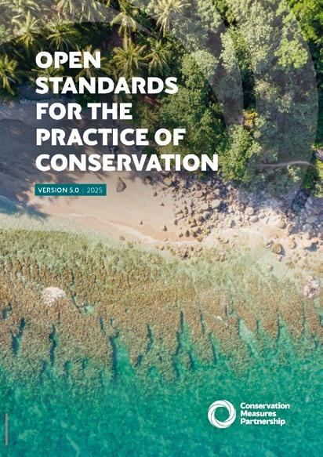

# Open Standards v5

Mystmd conversion of of the Open Standards for the Practice of Conservation v5. See introductory chapter for more details on the Standards. The Open Standards for the Practice of Conservation v5 can be found online [here](3point.xyz/cmp5/). PDF downloards are available for each chapter. However, the full production document in pdf format is at Conservation Standards [Download CS](https://conservationstandards.org/download-cs) page.

