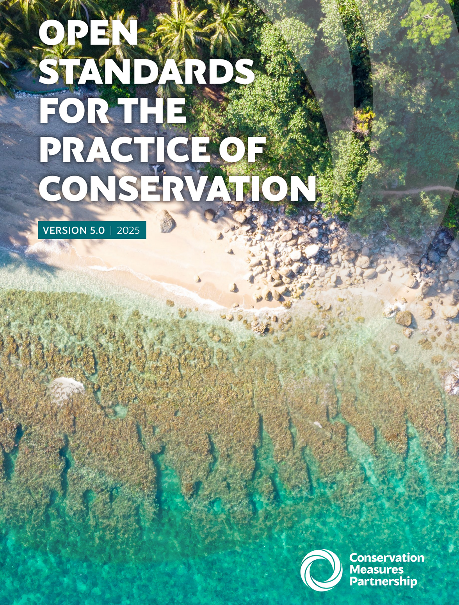

# Open Standards v5.0
  

## Open Standards
The Open Standards for the Practice of Conservation developed by the Conservation Measures Partnership (CMP) provide an extraordinary resource of best practices for successfully implementing conservation projects using a five-step management cycle. 

The full production document in PDF format is available at the Conservation Standards [Download CS](https://conservationstandards.org/download-cs) page. You may also access the Standards or the Conservation Measures Standards site by clicking the link above.

## Conversion
Conversion of the Open Standards for the Practice of Conservation v5.0 used [MyST](https://https://mystmd.org), an open-source, executable book framework indexed by chapters and sub-sections. The online version can be found at [3point.xyz/cmp5](https://3point.xyz/cmp5). PDF downloads are available for individual chapters, although figure and table cross-references for the Introduction chapter are not yet rendering correctly. We will resolve this in future iterations.

:::{warning} Changes to the Original Text
Select headers, URLs, tables, and figures have been edited for brevity and to fit within the MyST executable book format. Some photos have been removed. As a result, this version is not an exact facsimile of the OS v5.0, nor has CMP endorsed this work. Link to the PDF download is at the top of the page in the Open Standards page link.
:::

## Chapters
All chapters, images, and builds for the conversion can be found in the GitHub link above. The following chapters are included

- Introduction
- Conservation Standards Cycle Steps:
    1. Assess
    2. Plan
    3. Implement
    4. Analyze & Adapt
    5. Share
    6. Close the Loop
- Annexes

Each chapter is accessible via the links in the left panel of the page. Within each chapter, sub-sections are accessible in the right-hand panel. Search for any terms from the box in the page's upper right corner or use the command CTRL + K on your keyboard. The icon to the right of the search box allows you to switch between light and dark modes.